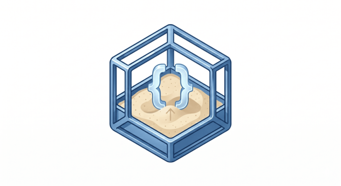

<p align="center">
  
</p>

# AgentSandbox

AgentSandbox is a local sandbox runtime for LLM agents and agentic tools.

It exposes one narrow operational surface:

- create an isolated sandbox
- execute commands inside it
- inspect status and TTL
- destroy it

Agents talk to a small local HTTP daemon through Python or TypeScript SDKs. The daemon routes work to backend plugins discovered at runtime, so the control plane stays stable while isolation backends remain replaceable.

## Why this exists

Agent code often needs to run untrusted or model-generated commands without giving the model raw access to the host. AgentSandbox puts a narrow API in the middle:

- agents use SDKs, not Docker or namespace internals
- the daemon enforces lifecycle, leases, TTL, persistence, and audit surface
- backend selection is explicit and plugin-driven
- backend-specific tuning lives behind `spec.extensions`

Minimal Python flow:

```python
from agentsandbox import Sandbox

async with Sandbox(runtime="python", ttl=900) as sb:
    result = await sb.exec("python -c 'print(42)'")
    print(result.stdout, end="")
```

## What is in the repo

- `crates/agentsandbox-daemon`: local HTTP daemon
- `crates/agentsandbox-core`: public spec parsing and `spec -> IR` compilation
- `crates/agentsandbox-sdk`: stable backend SDK and plugin protocol
- `crates/agentsandbox-backend-*`: backend plugins, buildable and installable independently
- `sdks/python`: async Python SDK
- `sdks/typescript`: async TypeScript SDK
- `examples/`: runnable end-to-end examples
- `docs/`: public API, deployment, and backend notes

## Architecture

```text
LLM agent / CLI / app
        |
        v
Python SDK / TypeScript SDK
        |
        v
AgentSandbox daemon
        |
        v
Discovered backend plugins
  - agentsandbox-backend-docker
  - agentsandbox-backend-podman
  - agentsandbox-backend-bubblewrap
  - agentsandbox-backend-wasmtime
  - ...
```

Backend plugins are normal executables named `agentsandbox-backend-*`. The daemon discovers them from configured search directories plus `PATH`, starts them as subprocesses, and talks to them through a JSON line protocol.

## Status

Implemented in the workspace today:

- public `sandbox.ai/v1` spec
- spec submission in JSON and YAML
- daemon with Axum + SQLite + TTL reaper
- Python SDK
- TypeScript SDK
- runtime plugin discovery and loading
- backend conformance coverage in the workspace

Current limits worth knowing:

- daemon config files are loaded from TOML or YAML, not JSON
- filtered egress in `v1` is still an interim design; the long-term direction remains the proxy-based path
- backend plugins must exist as executables before the daemon can use them
- examples that use an LLM assume an OpenAI-compatible `chat.completions` endpoint

## Capability Matrix

The daemon exposes upload/download/snapshot/restore uniformly. Actual support depends on the backend implementation; unsupported operations return `NOT_SUPPORTED`.

| Backend | Create / Exec / Destroy | Upload / Download | Snapshot / Restore | Notes |
| --- | --- | --- | --- | --- |
| `docker` | Yes | Yes | No | File transfer implemented via container archive APIs. |
| `podman` | Yes | Yes | No | Uses the Podman socket through the Docker-compatible container API surface exposed by Podman. |
| `gvisor` | Yes | Yes | No | Uses the Docker-compatible container API surface with `runsc` runtime checks. |
| `libkrun` | Yes | Yes | No | Uses a Docker-compatible container API surface through a Podman/krun runtime. |
| `bubblewrap` | Yes | Yes | Yes | Workspace-backed file I/O and filesystem snapshot/restore. |
| `nsjail` | Yes | Yes | Yes | Workspace-backed file I/O and filesystem snapshot/restore. |
| `wasmtime` | Yes | Yes | Yes | Compat runner plus workspace-backed file I/O and filesystem snapshot/restore. |

## Requirements

- Rust toolchain
- Python 3.10+
- Node.js 18+
- Docker running locally if you want the Docker backend
- Linux-specific host tools for some backends such as `bwrap`, `nsjail`, `runsc`, or `/dev/kvm`

## Quickstart

### 1. Build at least one backend plugin

For a first local run, Docker is the easiest option:

```bash
cargo build -p agentsandbox-backend-docker
```

This produces `target/debug/agentsandbox-backend-docker`, which the daemon discovers automatically thanks to the default `backends.search_dirs = ["target/debug"]`.

### 2. Start the daemon

```bash
cargo run -p agentsandbox-daemon
```

By default the daemon:

- reads `agentsandbox.toml` if present
- listens on `http://127.0.0.1:7847`
- stores state in `sqlite://agentsandbox.db`

### 3. Verify health

```bash
curl http://127.0.0.1:7847/v1/health
```

Expected shape:

```json
{"status":"ok","backend":"docker","backends":["docker"]}
```

If no backend plugins are available, the daemon still starts, but sandbox creation will fail until at least one backend is built or installed.

### 4. Create a sandbox through the HTTP API

JSON request:

```bash
curl -sS http://127.0.0.1:7847/v1/sandboxes \
  -H 'Content-Type: application/json' \
  -d '{
    "apiVersion": "sandbox.ai/v1",
    "kind": "Sandbox",
    "metadata": {},
    "spec": {
      "runtime": { "preset": "python" },
      "resources": { "cpuMillicores": 500, "memoryMb": 512 },
      "limits": { "timeoutMs": 30000, "ttlSeconds": 300 }
    }
  }'
```

YAML request:

```bash
curl -sS http://127.0.0.1:7847/v1/sandboxes \
  -H 'Content-Type: application/yaml' \
  --data-binary @- <<'YAML'
apiVersion: sandbox.ai/v1
kind: Sandbox
metadata: {}
spec:
  runtime:
    preset: python
  resources:
    cpuMillicores: 500
    memoryMb: 512
  limits:
    timeoutMs: 30000
    ttlSeconds: 300
YAML
```

### 5. Use the Python SDK

```bash
cd sdks/python
python -m venv .venv
source .venv/bin/activate
pip install -e ".[dev]"
```

```python
import asyncio
from agentsandbox import Sandbox


async def main() -> None:
    async with Sandbox(runtime="python", ttl=300, memory_mb=512) as sb:
        result = await sb.exec("python -c 'print(6 * 7)'")
        print(result.stdout, end="")


asyncio.run(main())
```

### 6. Use the TypeScript SDK

```bash
cd sdks/typescript
npm install
npm run build
```

```ts
import { Sandbox } from "agentsandbox";

await using sb = await Sandbox.create({
  runtime: "python",
  ttl: 300,
  memoryMb: 512,
  cpuMillicores: 500,
});

const result = await sb.exec("python -c 'print(6 * 7)'");
console.log(result.stdout.trim());
```

## Configuration and Spec Formats

There are two separate format surfaces:

- daemon config files: `TOML` or `YAML`
- sandbox creation requests (`POST /v1/sandboxes`): `JSON` or `YAML`

### Daemon config file

The daemon loads `agentsandbox.toml` by default, or another file via `AS_CONFIG`. Files ending in `.yaml` or `.yml` are parsed as YAML; everything else is treated as TOML.

TOML example:

```toml
[daemon]
host = "127.0.0.1"
port = 7847
log_level = "info"
log_format = "text"

[database]
url = "sqlite://agentsandbox.db"

[auth]
mode = "single_user"

[backends]
enabled = ["docker", "podman"]
search_dirs = ["target/debug", "/opt/agentsandbox/plugins"]

[backends.docker]
socket = "/var/run/docker.sock"

[backends.podman]
socket = "/run/user/1000/podman/podman.sock"
```

Equivalent YAML example:

```yaml
daemon:
  host: 127.0.0.1
  port: 7847
  log_level: info
  log_format: text

database:
  url: sqlite://agentsandbox.db

auth:
  mode: single_user

backends:
  enabled:
    - docker
    - podman
  search_dirs:
    - target/debug
    - /opt/agentsandbox/plugins
  docker:
    socket: /var/run/docker.sock
  podman:
    socket: /run/user/1000/podman/podman.sock
```

Useful environment overrides:

- `AS_CONFIG`
- `AS_DAEMON_HOST`
- `AS_DAEMON_PORT`
- `AS_DAEMON_LOG_LEVEL`
- `AS_DAEMON_LOG_FORMAT`
- `AS_DATABASE_URL`
- `AS_AUTH_MODE`
- `AS_BACKENDS_ENABLED`
- `AS_BACKENDS_SEARCH_DIRS`
- `AS_BACKENDS_<BACKEND>_<KEY>`

Example:

```bash
AS_BACKENDS_ENABLED=docker,gvisor \
AS_BACKENDS_DOCKER_SOCKET=/var/run/docker.sock \
AS_BACKENDS_GVISOR_RUNTIME=runsc \
cargo run -p agentsandbox-daemon
```

### Sandbox spec

The public spec is `sandbox.ai/v1`. Requests accept `application/json`, `application/yaml`, and `text/yaml`.

JSON example with backend routing and extensions:

```json
{
  "apiVersion": "sandbox.ai/v1",
  "kind": "Sandbox",
  "metadata": {},
  "spec": {
    "runtime": { "preset": "python" },
    "resources": { "cpuMillicores": 1000, "memoryMb": 1024 },
    "limits": { "timeoutMs": 60000, "ttlSeconds": 900 },
    "scheduling": { "backend": "docker" },
    "extensions": {
      "docker": {
        "hostConfig": {
          "capDrop": ["ALL"],
          "shmSizeMb": 64
        }
      }
    }
  }
}
```

Rule to keep in mind:

- `spec.extensions` requires `spec.scheduling.backend`
- extensions are validated against the selected backend schema
- some fields remain forbidden even inside extensions, for example Docker and Podman `networkMode`; use `spec.network.egress` instead

## Backend Plugins

The daemon can list discovered backends:

```bash
curl -sS http://127.0.0.1:7847/v1/backends
```

Every backend can also expose a live schema for its escape hatch:

```bash
curl -sS http://127.0.0.1:7847/v1/backends/docker/extensions-schema
```

`spec.extensions` is the general escape hatch for backend-specific knobs. The recommended pattern is:

1. route explicitly to a backend with `spec.scheduling.backend`
2. inspect `/v1/backends/:id/extensions-schema`
3. send only documented extension fields for that backend

### `docker`

Supported presets:

- `python`
- `node`
- `rust`
- `shell`

Daemon config parameters:

- `socket` default: `/var/run/docker.sock`

Capabilities:

- container isolation
- network isolation
- hard CPU and memory limits

Supported extensions under `spec.extensions.docker.hostConfig`:

- `capAdd`
- `capDrop`
- `securityOpt`
- `privileged`
- `shmSizeMb`
- `sysctls`
- `binds`
- `devices`
- `ulimits`

Example:

```yaml
spec:
  runtime:
    preset: python
  scheduling:
    backend: docker
  extensions:
    docker:
      hostConfig:
        capDrop: ["ALL"]
        shmSizeMb: 64
```

### `podman`

Supported presets:

- `python`
- `node`
- `rust`
- `shell`

Daemon config parameters:

- `socket`
  Default resolution order:
  `${XDG_RUNTIME_DIR}/podman/podman.sock` -> `/run/user/<uid>/podman/podman.sock` -> `/run/podman/podman.sock`

Capabilities:

- same execution model as Docker
- rootless-friendly default
- same extension schema as Docker

Example:

```toml
[backends.podman]
socket = "/run/user/1000/podman/podman.sock"
```

### `bubblewrap`

Supported presets:

- `python`
- `node`
- `rust`
- `shell`

Daemon config parameters:

- `bwrap_path` default: `bwrap`
- `rootfs_base` default: temp dir under `agentsandbox-bubblewrap`

Capabilities:

- rootless process isolation
- network isolation
- no hard CPU or memory limit enforcement in the current implementation

Supported extensions under `spec.extensions.bubblewrap`:

- `roBind`
- `rwBind`
- `gpuAccess`
- `extraArgs`

Example:

```yaml
spec:
  runtime:
    preset: shell
  scheduling:
    backend: bubblewrap
  extensions:
    bubblewrap:
      roBind:
        - ["/opt/data/model.bin", "/workspace/model.bin"]
```

### `wasmtime`

Supported presets:

- `python`
- `node`

Daemon config parameters:

- `python_wasm_path`
- `node_wasm_path`

Capabilities:

- self-contained process backend
- network isolation
- hard CPU and memory limits

Current execution scope:

- `echo ...`
- `echo ... >&2`
- `exit N`
- `python -c 'print(expr)'` for simple arithmetic expressions

Supported extensions under `spec.extensions.wasmtime`:

- `wasmBinary`
- `maxMemoryMb`
- `preloadedModules`

### `gvisor`

Supported presets:

- `python`
- `node`
- `rust`
- `shell`

Daemon config parameters:

- `socket` default: `/var/run/docker.sock`
- `runtime` default: `runsc`

Capabilities:

- kernel-sandbox isolation level
- hard CPU and memory limits
- Docker-compatible execution path with `runsc`

Supported extensions under `spec.extensions.gvisor`:

- `network` with values `sandbox`, `host`, `none`

### `libkrun`

Supported presets:

- `python`
- `node`
- `shell`

Daemon config parameters:

- `socket` default: Podman socket resolution
- `runtime` default: `krun`

Capabilities:

- microVM isolation level
- hard CPU and memory limits
- requires Linux and `/dev/kvm`

Supported extensions under `spec.extensions.libkrun`:

- `networkMode`
- `rootfsOverlay`

### `nsjail`

Supported presets:

- `python`
- `node`
- `rust`
- `shell`

Daemon config parameters:

- `nsjail_path` default: `nsjail`
- `chroot_base` default: temp dir under `agentsandbox-nsjail`

Capabilities:

- process isolation on Linux
- hard CPU and memory limits

Supported extensions under `spec.extensions.nsjail`:

- `seccompPolicy`
- `rlimitNofile`
- `rlimitNproc`
- `bindmountRo`
- `cgroupMemMax`

### About the escape hatch

`extensions` is intentionally backend-specific. It exists for features that do not belong in the portable public spec yet.

Use it when:

- you need a backend-native flag that is already implemented and documented
- you are evaluating a backend feature before promoting it into the stable spec

Avoid using it when:

- a portable field already exists in the public spec
- the requested field changes the security contract in a backend-specific way without audit visibility

## Examples

The examples are meant to be runnable, not decorative.

- [examples/01-hello-sandbox](examples/01-hello-sandbox/README.md): minimal Python flow
- [examples/02-code-review-agent](examples/02-code-review-agent/README.md): Python code review loop using an OpenAI-compatible model loaded from `.env`
- [examples/03-dependency-auditor](examples/03-dependency-auditor/README.md): TypeScript dependency audit with an OpenAI-compatible summary
- [examples/04-multi-backend-demo](examples/04-multi-backend-demo/README.md): same workload across discovered Python-capable backends

Workspace-wide verification:

```bash
bash examples/verify_all.sh
```

## Public API and Docs

- [docs/spec-v1.md](docs/spec-v1.md)
- [docs/api-http-v1.md](docs/api-http-v1.md)
- [docs/getting-started.md](docs/getting-started.md)
- [docs/deployment.md](docs/deployment.md)
- [docs/backends/docker.md](docs/backends/docker.md)
- [docs/backends/podman.md](docs/backends/podman.md)
- [examples/README.md](examples/README.md)

## Extending AgentSandbox

If you want to add a backend:

1. Create a crate named `agentsandbox-backend-<name>`.
2. Implement `BackendFactory` and `SandboxBackend` from `agentsandbox-sdk`.
3. Add a `src/main.rs` that serves the plugin protocol.
4. Expose an `extensions_schema` if the backend supports backend-specific options.
5. Ship the executable so the daemon can discover it from `PATH` or `backends.search_dirs`.
6. Add conformance tests and backend docs.

Start from [BACKEND_GUIDE.md](BACKEND_GUIDE.md).

The architectural boundary is simple: if the daemon needs to link your backend crate to use it, the plugin boundary is wrong.

## Contributing

Typical local loop:

```bash
cargo test --workspace
cd sdks/python && pytest -q
cd sdks/typescript && npm test
```

When touching examples, also run:

```bash
bash examples/verify_all.sh
```

## Development Ideas

Good next areas to push:

- tighten backend capability matching so routing decisions become more explainable
- improve plugin install and distribution ergonomics for out-of-tree backends
- expand conformance coverage for non-Docker backends
- push the egress model toward the stable proxy-based path
- ship a production-ready `firecracker` backend instead of only reserving the contract surface
- add a `kata-containers` or equivalent VM-backed plugin for a clearer middle ground between containers and microVMs
- add an `incus` or `lxc` backend for teams that already run system-container tooling
- improve backend docs so each plugin has a concrete matrix of presets, host requirements, and extension fields

## License

Apache-2.0
