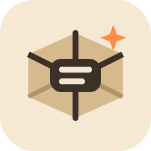

<p align="center">
  
</p>

# AgentSandbox

AgentSandbox is a local sandbox runtime for LLM agents and agentic tools.

It gives you one stable primitive:

- create an isolated sandbox
- execute commands inside it
- inspect status and TTL
- destroy it

Your agent talks to a small local HTTP daemon through Python or TypeScript SDKs. The daemon does not need to know which backend your code was written against, and the core does not link backend crates directly anymore: backends are external plugins discovered at runtime.

## Why this exists

Agent code often needs to run untrusted or model-generated commands without giving the model raw access to the host. AgentSandbox puts a narrow API in the middle:

- agents use SDKs, not Docker or namespace internals
- the daemon enforces lifecycle, leases, TTL, persistence, and audit surface
- backends stay replaceable: Docker today, others through plugins

The target user experience is still the same:

```python
from agentsandbox import Sandbox

async with Sandbox(runtime="python", ttl=900) as sb:
    result = await sb.exec("python -c 'print(42)'")
    print(result.stdout, end="")
```

## What is in the repo

- `crates/agentsandbox-daemon`: local HTTP daemon
- `crates/agentsandbox-core`: public spec parsing and `spec -> IR` compilation
- `crates/agentsandbox-sdk`: stable backend SDK and plugin protocol
- `crates/agentsandbox-backend-*`: backend plugins, each buildable and installable independently
- `sdks/python`: async Python SDK
- `sdks/typescript`: async TypeScript SDK
- `examples/`: runnable end-to-end examples, including OpenAI-compatible LLM flows

## Architecture

```text
LLM agent / CLI / app
        |
        v
Python SDK / TypeScript SDK
        |
        v
AgentSandbox daemon
        |
        v
Discovered backend plugins
  - agentsandbox-backend-docker
  - agentsandbox-backend-podman
  - agentsandbox-backend-wasmtime
  - ...
```

Backend plugins are normal executables named `agentsandbox-backend-*`. The daemon discovers them from configured search directories plus `PATH`, starts them as subprocesses, and talks to them through a JSON line protocol. This keeps the core independent from backend implementation crates and allows installations with zero, one, or many plugins.

## Status

Implemented and passing in the workspace today:

- public `sandbox.ai/v1` spec
- JSON and YAML input support
- daemon with Axum + SQLite + TTL reaper
- Python SDK
- TypeScript SDK
- runtime plugin discovery and loading
- backend conformance tests in the workspace

Important current limits:

- filtered egress in `v1` is still an interim design; the long-term direction remains the proxy L4 path
- plugin discovery is runtime-based, so a backend must be built or installed as an executable before the daemon can use it
- examples that use an LLM assume an OpenAI-compatible `chat.completions` endpoint

## Requirements

- Rust toolchain
- Python 3.10+
- Node.js 18+
- Docker running locally if you want to use the Docker backend

## Quickstart

### 1. Build at least one backend plugin

For a first local run, Docker is the easiest option:

```bash
cargo build -p agentsandbox-backend-docker
```

This produces `target/debug/agentsandbox-backend-docker`, which the daemon discovers automatically thanks to the default `backends.search_dirs = ["target/debug"]`.

### 2. Start the daemon

```bash
cargo run -p agentsandbox-daemon
```

By default it reads `agentsandbox.toml`, listens on `http://127.0.0.1:7847`, and stores state in `sqlite://agentsandbox.db`.

### 3. Verify health

```bash
curl http://127.0.0.1:7847/v1/health
```

Expected shape:

```json
{"status":"ok","backend":"docker","backends":["docker"]}
```

If no backend plugins are available, the daemon still starts, but sandbox creation will fail until you build or install at least one plugin.

### 4. Use the Python SDK

```bash
cd sdks/python
python -m venv .venv
source .venv/bin/activate
pip install -e ".[dev]"
```

```python
import asyncio
from agentsandbox import Sandbox


async def main() -> None:
    async with Sandbox(runtime="python", ttl=300) as sb:
        result = await sb.exec("python -c 'print(42)'")
        print(result.stdout, end="")


asyncio.run(main())
```

### 5. Use the TypeScript SDK

```bash
cd sdks/typescript
npm install
npm run build
```

```ts
import { Sandbox } from "agentsandbox";

await using sb = await Sandbox.create({ runtime: "python", ttl: 300 });
const result = await sb.exec("python -c 'print(42)'");
console.log(result.stdout.trim());
```

## Configuration

The daemon supports TOML and YAML config files.

Minimal example:

```toml
[daemon]
host = "127.0.0.1"
port = 7847

[database]
url = "sqlite://agentsandbox.db"

[auth]
mode = "single_user"

[backends]
enabled = ["docker"]
search_dirs = ["target/debug"]

[backends.docker]
socket = "/var/run/docker.sock"
```

Useful environment overrides:

- `AS_CONFIG`
- `AS_DAEMON_HOST`
- `AS_DAEMON_PORT`
- `AS_DATABASE_URL`
- `AS_AUTH_MODE`
- `AS_BACKENDS_ENABLED`
- `AS_BACKENDS_SEARCH_DIRS`
- `AS_BACKENDS_<BACKEND>_<KEY>`

Example:

```bash
AS_BACKENDS_ENABLED=docker \
AS_BACKENDS_DOCKER_SOCKET=/var/run/docker.sock \
cargo run -p agentsandbox-daemon
```

## Examples

The examples are meant to be runnable, not decorative.

- [examples/01-hello-sandbox](examples/01-hello-sandbox/README.md): minimal Python flow
- [examples/02-code-review-agent](examples/02-code-review-agent/README.md): Python code review loop using an OpenAI-compatible model loaded from `.env`
- [examples/03-dependency-auditor](examples/03-dependency-auditor/README.md): TypeScript dependency audit with an OpenAI-compatible summary
- [examples/04-multi-backend-demo](examples/04-multi-backend-demo/README.md): same workload across all discovered Python-capable backends

Workspace-wide verification:

```bash
bash examples/verify_all.sh
```

The script skips examples whose local prerequisites are missing instead of failing for trivial bootstrap reasons.

## Public API

- [docs/spec-v1.md](docs/spec-v1.md)
- [docs/api-http-v1.md](docs/api-http-v1.md)
- [docs/getting-started.md](docs/getting-started.md)
- [docs/deployment.md](docs/deployment.md)
- [examples/README.md](examples/README.md)

## Extending AgentSandbox

If you want to add a backend:

1. Create a crate named `agentsandbox-backend-<name>`.
2. Implement `BackendFactory` and `SandboxBackend` from `agentsandbox-sdk`.
3. Add a `src/main.rs` that serves the plugin protocol.
4. Ship the executable so the daemon can discover it from `PATH` or `backends.search_dirs`.
5. Add conformance tests and backend docs.

Start from [BACKEND_GUIDE.md](BACKEND_GUIDE.md).

The important boundary is this: if the daemon needs to link your crate to use it, the architecture is wrong.

## Contributing

Typical local loop:

```bash
cargo test --workspace
cd sdks/python && pytest -q
cd sdks/typescript && npm test
```

When touching examples, also run:

```bash
bash examples/verify_all.sh
```

Good issues to work on:

- tighten backend capability matching
- improve plugin install/distribution ergonomics
- expand conformance coverage for non-Docker backends
- push the egress model toward the stable proxy-based path

## License

Apache-2.0
